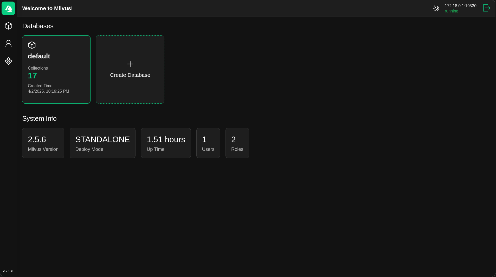
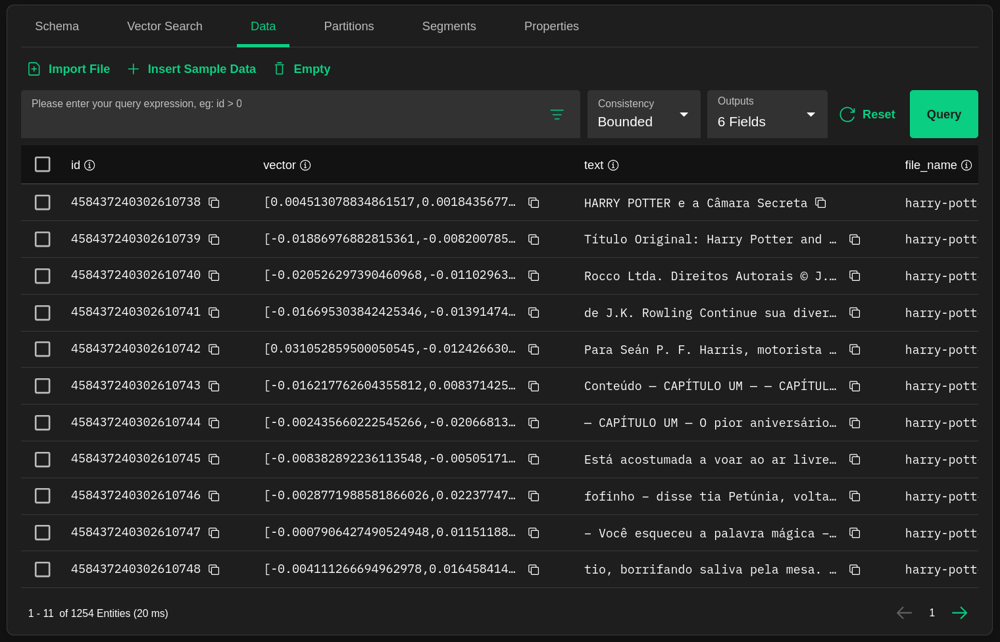
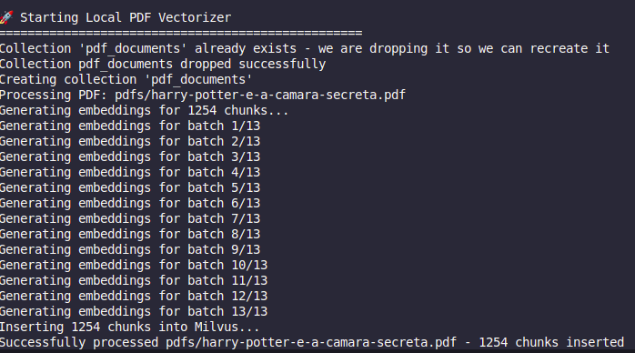
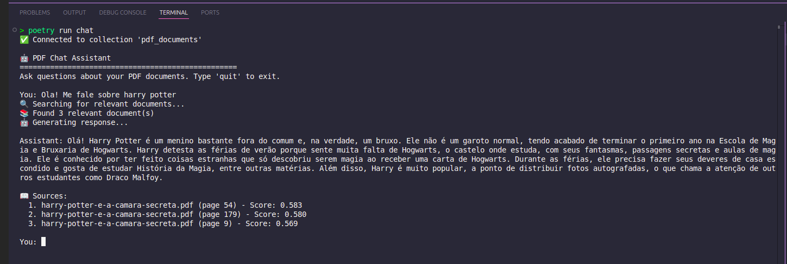

# Local RAG System

## What is RAG (Retrieval-Augmented Generation)?

RAG is an AI framework that combines the strengths of traditional information retrieval systems with the capabilities of generative large language models (LLMs). Instead of relying solely on pre-trained data, RAG allows LLMs to retrieve relevant information from external knowledge sources before generating responses.

**Key benefits:**
- **Accurate responses**: Reduces AI hallucinations by grounding answers in factual data (Files that you pass to it)
- **Up-to-date information**: Access current data without retraining the model (Always updated if the files you give)
- **Cost-effective**: No fine-tuning or retrain the model

## Tools

- **Python 3.12+**
- **OpenAI API** - For embeddings (text-embedding-3-large) and chat completion (gpt-4.1-mini)
- **Milvus** - Vector database for storing and searching embeddings
- **PyMuPDF** - PDF text extraction
- **LangChain** - Text chunking and processing
- **Poetry** - Project/Dependency management
- **Docker** - For running Milvus locally
- **Attu** - Milvus web UI (Just to check if everything is alright)

## Project Structure

```
local-RAG/
├── README.md
├── chat.py # Chat interface
├── config.py # Configuration settings
├── pyproject.toml # Poetry dependencies
├── utils.py # Helper functions
├── vectorizer.py # PDF processing and vectorization
├── pdfs/ # Directory for PDF files
├── .env # Environment variables
└── tests/ # Test files
```


## Installation & Setup

### 1. Prerequisites

**Docker:**

**OBS: Im running this project on linux (Ubuntu)**

You need to run Milvus vector database on docker! He is going to save the vectors/embeddings that we are going to access as context!
So you need to install **DOCKER**

**Install Poetry:**

``` bash
curl -sSL https://install.python-poetry.org | python3 -
```
### 2. Clone and Setup Project

```
git clone <Repo-URL>
cd local-RAG
poetry install
```

### 3. Environment Configuration

Create a `.env` file:
echo "OPENAI_API_KEY=your_openai_api_key_here" > .env

OR

Just acess the `.env` file and create the OPENAI_API_KEY=openai_key_here

After that insert the other variables, it should look like this:

``` text
OPENAI_API_KEY=your_openai_api_key_here
VM_ADDRESS=https://VMadress-8000.proxy.runpod.net/v1
LOCAL_VM_ADDRESS=http://localhost:8000/v1

```

### 4. Start Milvus Database

**Download and start Milvus:**

Using Docker Compose:

Download docker-compose file

https://github.com/milvus-io/milvus/releases/download/v2.3.3/milvus-standalone-docker-compose.yml

```
docker-compose up -d
```

**Verify Milvus is running:**

```
docker ps
```

Should show milvus container running on port 19530

### 5. Install Attu (Milvus Web UI)

**OBS: Im running on port 3001, you can run whenever you want**

```
docker run -p 3001:3000 -e MILVUS_URL=localhost:19530 zilliz/attu:v2.5
Access Attu at: `http://localhost:3001`
```

### Attu Interface


### Attu vector example


# Guide

## Step 1: Add PDF Documents

Create pdfs directory (if not exists)
Add your PDF files to the pdfs/ directory

## Step 2: Process PDFs (Vectorization)

Run vectorizer to extract text and create embeddings (Remember he will run with the files .pdf on your pdfs folder)

``` python
poetry run vectorize
```
This will:
- Extract text from all PDFs in the `pdfs/` folder
- Chunk the text into smaller pieces
- Generate embeddings using OpenAI's text-embedding-3-large
- Store vectors in Milvus database
- Clean existing collection if it exists



## Step 3: Start Chat Interface

Launch interactive chat
```
poetry run chat
```

Type: quit -- To exit the chat!



### Step 3.1: Start Chat Interface in a VM with your model

If you want you can run the chat_vm.py version, it will run with any model you want that is running on a VM that you created!

In this small example im running on a VM that i created in runpod.io and a local Machine that i have.

For this to work you just need to change:

* The .env configs
* Set the model that you are using  (Im using: ibm-granite/granite-3.3-8b-instruct), you need to change it on the config.py

After that, just:

```
poetry run chat_vm
```

If you follow this steps you are going to create a RAG with the model you want!


## Step 4: Ask Questions!!! Use it as a personal assistant with your personal documents